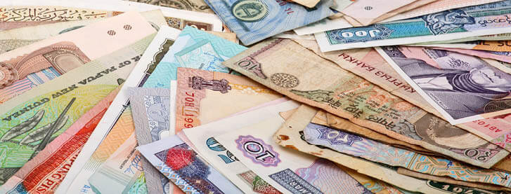

# Cash
> Currency converter implemented in Nodejs.
<p align="center">
  
</p>

## How to Use
- Clone this repository : `https://github.com/IlyessAgg/3-musketeers`

```sh
❯ cd /path/to/workspace
❯ git clone git@github.com:IlyessAgg/3-musketeers.git
```
- Go to the cash folder and install dependencies :

```
npm i
```

- Launch cash : `node /bin/index.js cash --help `

```sh
  Usage
        $ cash <amount> <from> <to>
        $ cash <options>
  Options
        --set -s                        Set default currencies
  Examples
        $ cash 10 usd eur pln
        $ cash --set usd aud
```

- `amount`: amount of money to convert.
- `from`: currency you want to convert from.
- `to`: currency you want to convert to.
- `--set <favorite>`: used to set the default currency to `<favorite>`.